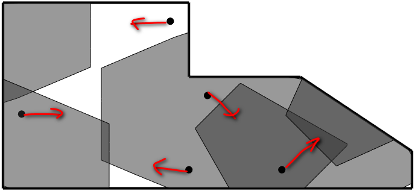
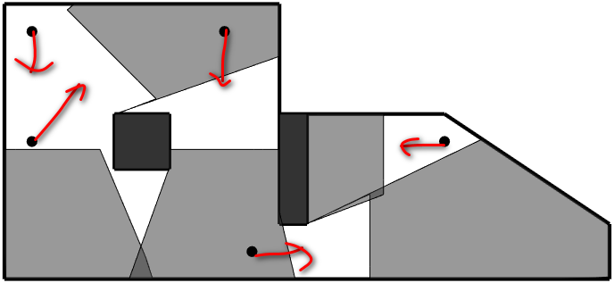
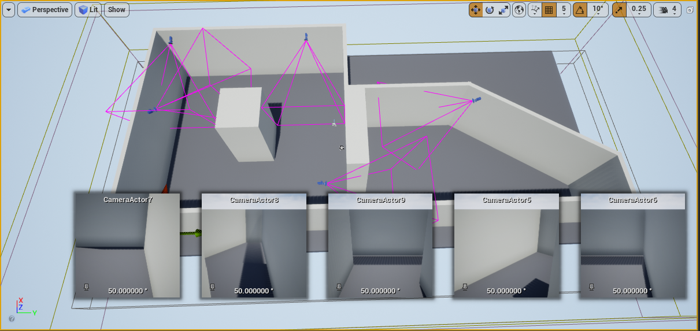
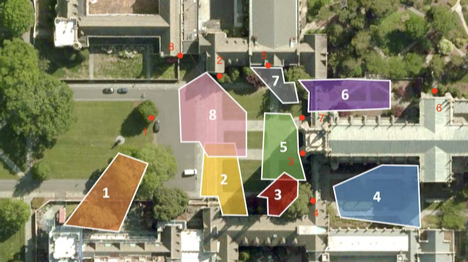
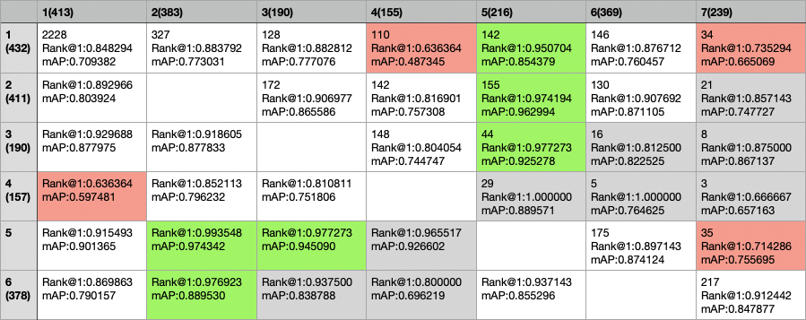

## 完成的工作
在已有工作思路的基础上，利用matlab仿真实现四个自由度的相机布置问题（包括相机的x, y, pitch, yaw，高度固定），同时在考虑相机覆盖时考虑的是三维空间（x, y, z），并考虑相机成像质量，用目标到相机的距离对所覆盖的空间点进行筛除。实现的方式是利用二进制0-1规划进行问题建模，然后用遗传算法进行求解。

已有的实验结果：  
  
实验结果一：较简单场景，不考虑障碍物。  
黑点表示相机位置，梯形表示的是相机在地面的覆盖范围，红色箭头表示相机朝向。（这里限制相机数小于等于5）  
  
实验结果二：考虑障碍物。  
这里没有预定义每个区域的重要性，整体的布置结果还算可以，但是计算时间花费较长。

UE中制作的效果展示：  
   

与reID结合的实验和思考：利用开源reID的baseline代码比较了不同相机对的识别成功率，通过对不同相机对识别率进行观察，找到在相机布置时应该考虑的约束。  
   

Duke数据集有相机的布置示意图（如上），通过观察采集的图像我自己标了一下相机的位置，即每个红点的位置，旁边的数字和投影区域相对应。  
将gallery和query集的图像分别限定在一个相机下，下图表格(如下）中左上角第一个数表明query集一共有2228个对象，在以resNet50为backbone的网络下rank1可以达到84.82%，表格横向表示query的相机，纵向表示gallery的相机，如第一行第二个表格项表示2号相机为query时，在1号相机采集的图像中进行重识别的rank1为88.37%，327表示目标标签的重叠数，即2号相机383个query对象中，有327个在1号相机中出现，其余对象没有出现，rank1计算时只考虑可重识别到的对象集合。为了突出重点，用绿色标识rank1超过平均水平（84.82%）十个点的相机对，红色标识rank1低于平均水平十个点的相机对。  

  

对比相机布置图，通过观察可得到的初步结论：  
1.相机间的目标重叠率取决于相机间的拓扑关系和拍摄场景的关联关系；  
2.识别率较高的相机对总结：  
&emsp;2-5相机对：相近的相机朝向可以提高reid识别率；  
&emsp;2-3，3-5相机对：相近的投影区域可以提高reid识别率（相机间存在比较强的关联）；  
&emsp;2-6相机对：可能是较小的fov使然，较小的fov意味着目标清晰度更高；  
3.而识别率较低的相机对可以归纳为朝向偏差的过大，导致的原因可能是采集行人姿态差异大。

**目前存在的问题**：模拟实验的场景比较小且简单，同时缺少不同表观特征的行人模型进行虚拟场景下的实验。
